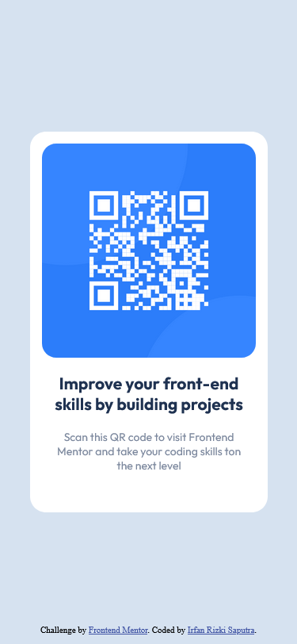
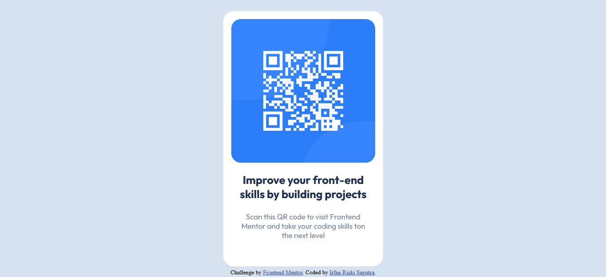

# Frontend Mentor - QR code component solution

This is a solution to the [QR code component challenge on Frontend Mentor](https://www.frontendmentor.io/challenges/qr-code-component-iux_sIO_H). Frontend Mentor challenges help you improve your coding skills by building realistic projects. 

## Table of contents

- [Overview](#overview)
  - [Screenshot](#screenshot)
  - [Links](#links)
- [My process](#my-process)
  - [Built with](#built-with)
  - [What I learned](#what-i-learned)
  - [Continued development](#continued-development)
  - [Useful resources](#useful-resources)
- [Author](#author)

## Overview

  this task i made basic html css website that contain qr code (image, font, color are already provided by frontendmentor.io) and some polosh.

### Screenshot




### Links

- Replit Url: [https://replit.com/@nafri97/QR-code-cpmponent?v=1]

## My process

  just basic nothing to explain :)

### Built with

- Semantic HTML5 markup
- CSS
- Google fonts


### What I learned
  from this project I've learned how to centered content in css with this code is:

```css
.wrap {
    left: 50%;
    top: 50%;
    transform: translate(-50%,-50%);
    position: absolute;
}

### Continued development

    I want to improve my skill on front-end starts from css expertise (especially its framework e.g. bootstrap and tailwind css). and
    then Javascript and so on.  

### Useful resources

- [W3 schools](https://www.w3schools.com) - This helped me for exploring any css reference.

## Author

- Github - [nafri97](https://gihub.com/nafri97)
- Frontend Mentor - [@nafri97](https://www.frontendmentor.io/profile/nafri97)
- Twitter - [@irfanrizkis](https://www.twitter.com/irfanrizkis)
